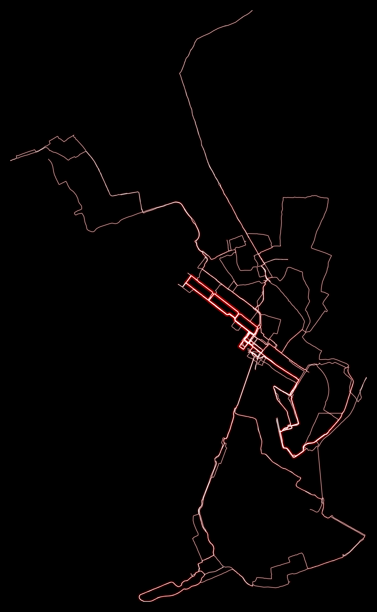
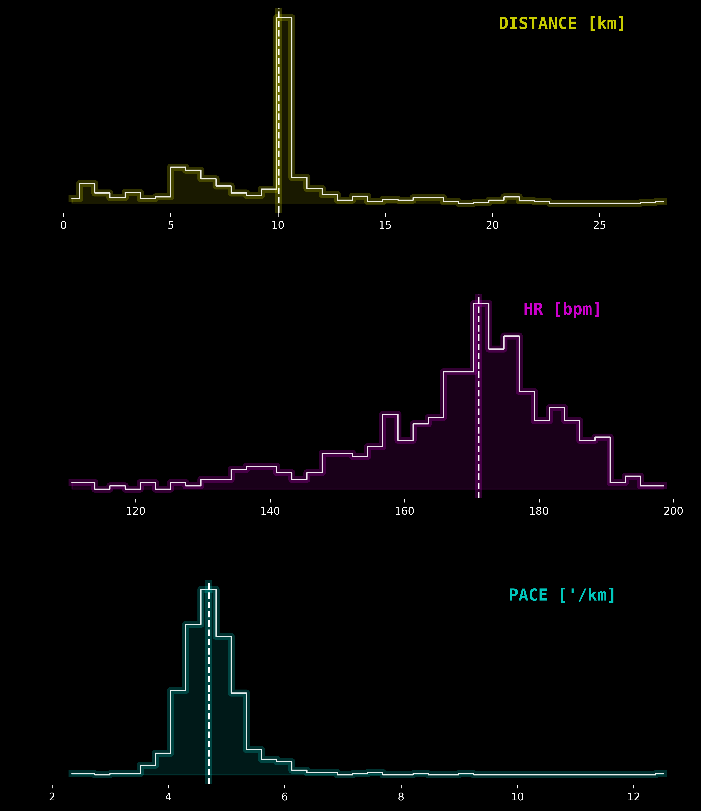
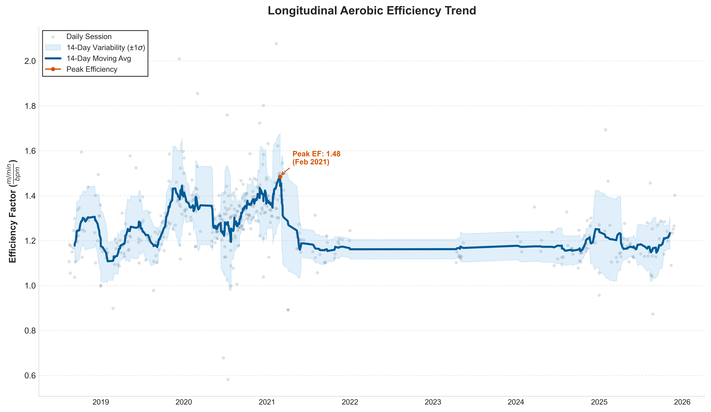
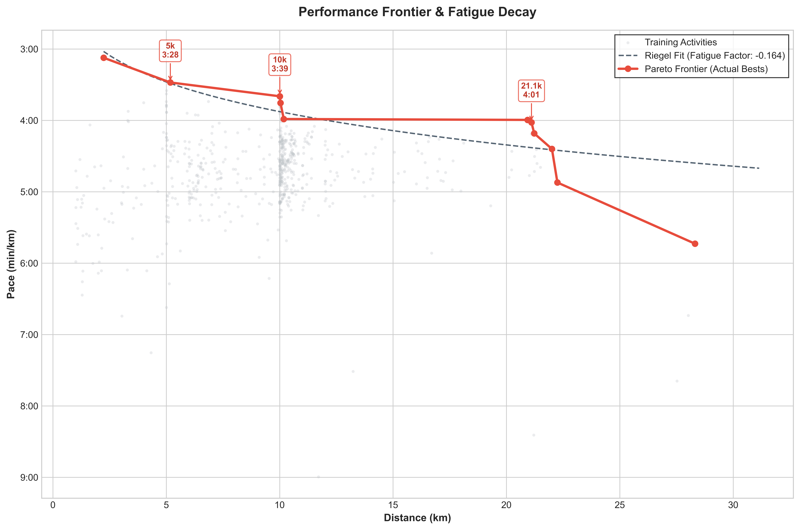

# 🏃 Strava Intelligence

A Python toolkit for analyzing and visualizing your Strava activities without paying for Strava Premium. Sync your activities, generate cool visualizations, and track your performance metrics over time. This repository is conceived as a starting point for building more advanced Strava data analysis tools. I will keep adding features and visualizations over time.


> ⚠️ **Disclaimer**: This project stores Strava data locally on your machine. It is the responsibility of each user to comply with [Strava's API Agreement](https://www.strava.com/legal/api) and their terms regarding data storage and usage. Please review Strava's policies before using this tool.

## ✨ Current features

- **Activity Sync**: Automatically sync and cache your Strava activities locally using Parquet files
- **Cool Visualizations**: Generate visualizations including:
  - ⚡ **Thunderstorm Heatmap**: Neon-style activity route visualization on dark backgrounds
  - 🕐 **Activity Clock**: Polar scatter plot showing when you train (time vs distance)
  - 🎛️ **HUD Dashboard**: Cyberpunk-style histograms for distance, heart rate, and pace
  - 📈 **Efficiency Factor**: Track your aerobic efficiency (speed/HR) over time
  - 🚀 **Performance Frontier**: Pareto frontier with Riegel's fatigue model fitting
- **Analytics**: WIP
- **GeoJSON Export**: Export your activities as GeoJSON for use in mapping applications sycg as QGIS
- **Smart Caching**: Efficient local caching with incremental sync supportm to avoid redundant API calls

## 📋 Prerequisites

- Python 3.11+
- A Strava account with API access
- Strava API credentials (Client ID and Client Secret)

## 🔧 Installation

### Using Poetry (Recommended)

```bash
# Clone the repository
git clone https://github.com/rsanchezmo/strava-intelligence.git
cd strava-intelligence

# Install dependencies with Poetry
poetry install

# Activate the virtual environment
poetry shell
```

### Using pip

```bash
# Clone the repository
git clone https://github.com/rsanchezmo/strava-intelligence.git
cd strava-intelligence

# Create a virtual environment
python -m venv .venv
source .venv/bin/activate  # On Windows: .venv\Scripts\activate

# Install the package
pip install -e .
```

## 🔑 Strava API Setup

1. Go to [Strava API Settings](https://www.strava.com/settings/api)
2. Create a new application to get your **Client ID** and **Client Secret**
3. Create a `.env` file in the project root:

```env
STRAVA_CLIENT_ID=your_client_id
STRAVA_CLIENT_SECRET=your_client_secret
```

4. On first run, the app will open a browser for OAuth authorization. Follow the prompts to grant access.

## 🚀 Quick Start

```python
from strava.strava_intelligence import StravaIntelligence
from pathlib import Path

# Initialize (auto-syncs activities if cache is older than 12 hours)
strava = StravaIntelligence(workdir=Path("./strava_intelligence_workdir"))

# Generate a thunderstorm heatmap for your runs in Amsterdam
strava.strava_visualizer.thunderstorm_heatmap(
    sport_types=['Run'],
    location="amsterdam",
    radius_km=20.0,
    add_basemap=False
)

# Create an activity clock visualization
strava.strava_visualizer.activity_clock(sport_types=['Run'])

# Generate a HUD-style dashboard
strava.strava_visualizer.hud_dashboard(sport_types=['Run'])

# Plot efficiency factor trend
strava.strava_visualizer.plot_efficiency_factor(sport_types=['Run'])

# Plot performance frontier with fatigue model
strava.strava_visualizer.plot_performance_frontier(sport_types=['Run'])

# Export activities as GeoJSON
strava.save_geojson_activities()
```

## 📊 Visualizations

### Thunderstorm Heatmap
A stunning neon visualization of your activity routes on a dark canvas. Perfect for showcasing your training coverage in a specific area.



### Activity Clock
A polar plot showing the distribution of your activities by time of day and distance. Discover your training patterns at a glance.


### HUD Dashboard
Cyberpunk-inspired histograms displaying the distribution of:
- Distance (km)
- Heart Rate (bpm)
- Pace (min/km)



### Efficiency Factor
Track your aerobic efficiency over time with rolling averages and variance bands. Identify peak performance periods.



### Performance Frontier
Visualize your best performances across different distances with Riegel's power-law fatigue model fitting.



### QGIS GeoJSON Export
Easily export your Strava activities as GeoJSON files for advanced mapping and spatial analysis in GIS software like QGIS.


## 🏗️ Project Structure

```
strava-intelligence/
├── main.py                    # Example usage
├── pyproject.toml             # Poetry configuration
├── README.md
└── strava/
    ├── constants.py           # CRS constants
    ├── strava_activities_cache.py  # Activity caching logic
    ├── strava_analytics.py    # Analytics calculations
    ├── strava_endpoint.py     # Strava API client
    ├── strava_intelligence.py # Main orchestrator class
    ├── strava_user_cache.py   # User data caching
    ├── strava_utils.py        # Utility functions
    └── strava_visualizer.py   # Visualization generators
```

## 📝 API Reference

### StravaIntelligence

The main class that orchestrates all functionality.

```python
StravaIntelligence(
    workdir: Path,           # Working directory for outputs
    auto_sync: bool = True,  # Auto-sync on initialization
    sync_max_age_hours: int = 12  # Cache age threshold
)
```

**Current methods:**
- `sync_activities(full_sync=False, include_streams=False)` - Sync activities from Strava
- `save_geojson_activities()` - Export activities as GeoJSON

### StravaVisualizer

Generates all visualizations.

**Current methods:**
- `thunderstorm_heatmap(location, sport_types, radius_km, add_basemap, neon_color, show_title)`
- `activity_clock(sport_types, neon_color, max_dist_km, show_title)`
- `hud_dashboard(sport_types, bins)`
- `plot_efficiency_factor(sport_types, window)`
- `plot_performance_frontier(sport_types)`

### StravaAnalytics

Provides analytics calculations.

**Current methods:**
- `get_rest_heart_rate()` - Get estimated resting heart rate
- `get_max_heart_rate()` - Get maximum heart rate from zones
- `get_current_vo2_max()` - Calculate VO2 Max estimate

## 🤝 Contributing

Contributions are welcome! Please feel free to submit a Pull Request.
