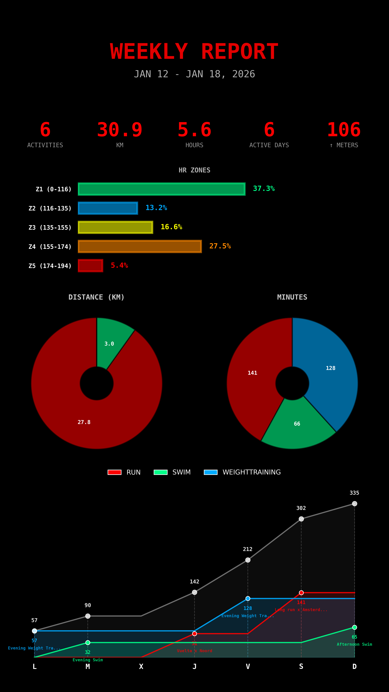
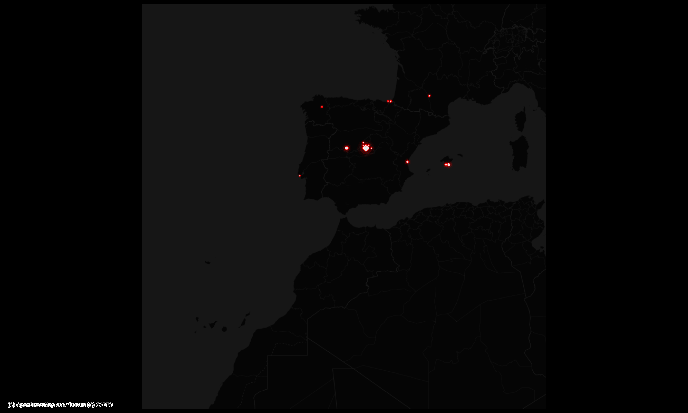
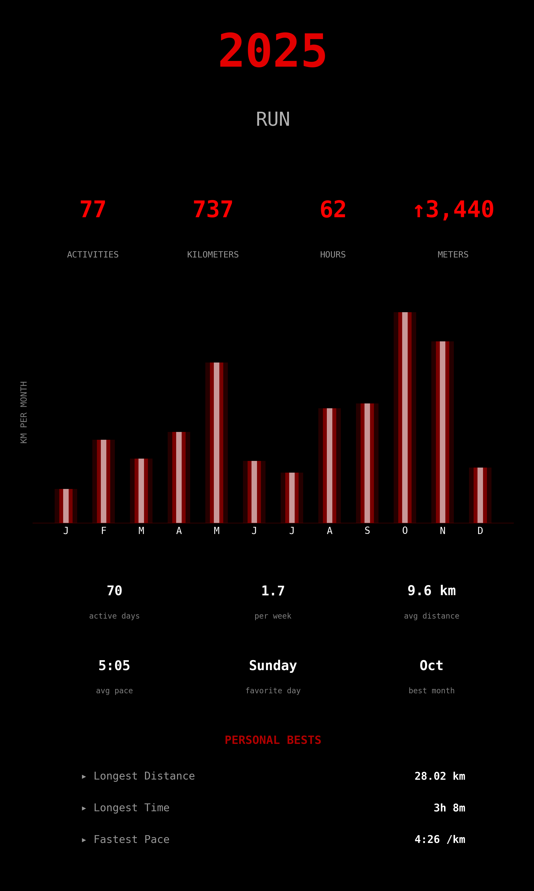
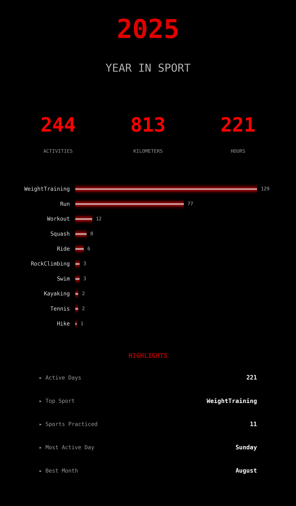
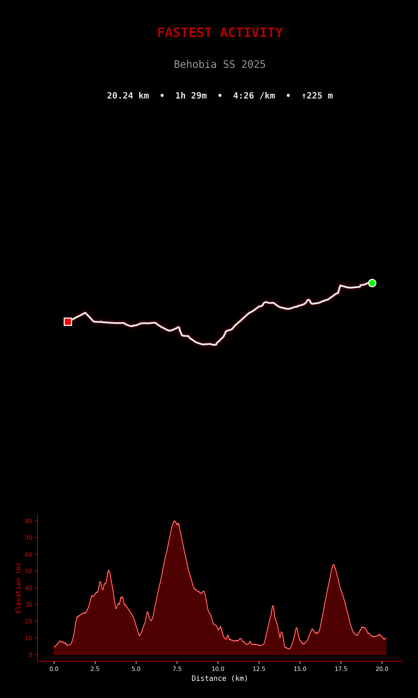
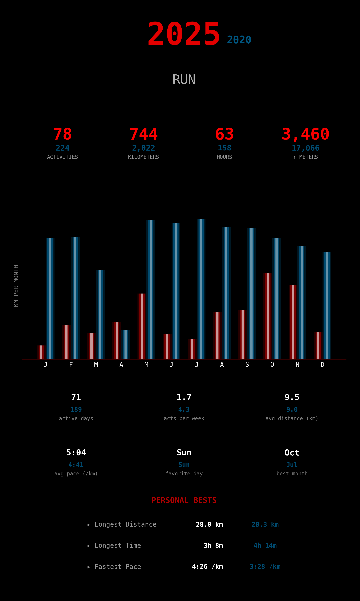
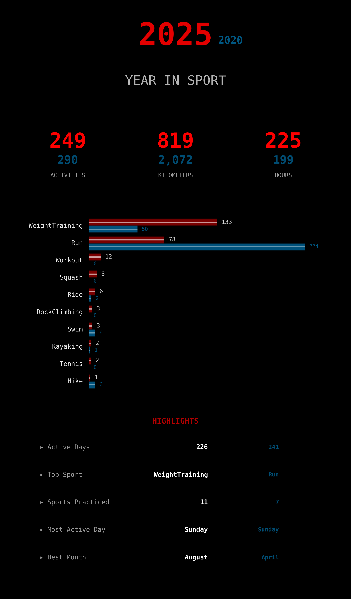
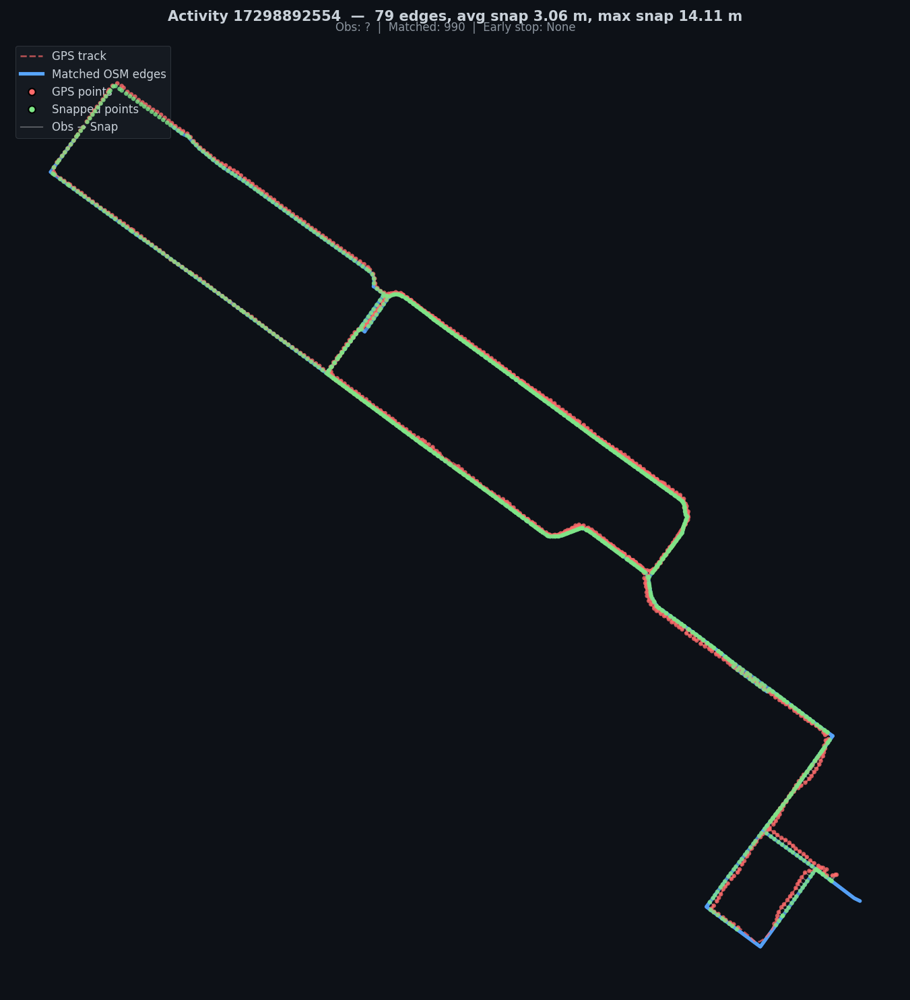

# 🏃 Strava Intelligence

A Python toolkit for analyzing and visualizing your Strava activities without paying for Strava Premium. Sync your activities, generate cool visualizations, and track your performance metrics over time. This repository is conceived as a starting point for building more advanced Strava data analysis tools. I will keep adding features and visualizations over time.


> ⚠️ **Disclaimer**: This project stores Strava data locally on your machine. It is the responsibility of each user to comply with [Strava's API Agreement](https://www.strava.com/legal/api) and their terms regarding data storage and usage. Please review Strava's policies before using this tool.

## ✨ Current features

- **Activity Sync**: Automatically sync and cache your Strava activities locally using Parquet files
- **Cool Visualizations**: Generate visualizations including:
  - ⚡ **Thunderstorm Heatmap**: Neon-style activity route visualization on dark backgrounds
  - 🕐 **Activity Clock**: Polar scatter plot showing when you train (time vs distance)
  - 🎛️ **HUD Dashboard**: Cyberpunk-style histograms for distance, heart rate, and pace
  - 📈 **Efficiency Factor**: Track your aerobic efficiency (speed/HR) over time
  - 🚀 **Performance Frontier**: Pareto frontier with Riegel's fatigue model fitting
  - 📅 **Weekly Report**: Instagram Story-sized weekly training summary with HR zones, sports breakdown, and accumulated training time
  - 🎯 **Year in Sport**: Instagram Story-sized summaries of your yearly training (main sport & totals)
  - 🏆 **Activity Plots**: Neon-style individual activity visualization with elevation profile
- **Map Matching**: Match GPS tracks to OpenStreetMap road networks using HMM-based matching:
  - 🗺️ **Street Coverage Map**: Neon-glow visualization of all streets you've traversed in a city
  - 📍 **Activity Match Plot**: Per-activity visualization showing GPS track, matched OSM edges, and snap points
  - 📊 **Coverage Stats**: Track how many km of a city's street network you've covered
- **Analytics**: WIP
- **GeoJSON Export**: Export your activities as GeoJSON for use in mapping applications such as QGIS
- **Telegram Bot**: Automated scheduled delivery of weekly and monthly reports to your Telegram chat
- **Smart Caching**: Efficient local caching with incremental sync supportm to avoid redundant API calls

## 📋 Prerequisites

- Python 3.12+
- A Strava FREE account with API access
- Strava API credentials (Client ID and Client Secret)

## 🔧 Installation

### Using Poetry (Recommended)

```bash
# Clone the repository
git clone https://github.com/rsanchezmo/strava-intelligence.git
cd strava-intelligence

# Install dependencies with Poetry
poetry install

# Activate the virtual environment
poetry env activate
```

### Using pip

```bash
# Clone the repository
git clone https://github.com/rsanchezmo/strava-intelligence.git
cd strava-intelligence

# Create a virtual environment
python -m venv .venv
source .venv/bin/activate  # On Windows: .venv\Scripts\activate

# Install the package
pip install -e .
```

## 🔑 Strava API Setup

1. Go to [Strava API Settings](https://www.strava.com/settings/api)
2. Create a new application to get your **Client ID** and **Client Secret**
3. Create a `.env` file in the project root:

```env
STRAVA_CLIENT_ID=your_client_id
STRAVA_CLIENT_SECRET=your_client_secret
```

4. On first run, the app will open a browser for OAuth authorization. Follow the prompts to grant access.

## 🤖 Telegram Bot Setup (Optional)

You can optionally set up a Telegram bot to receive automated weekly reports (Sundays at 21:00) and monthly Year in Sport summaries (last day of month at 21:00).

1. Create a Telegram bot via [@BotFather](https://t.me/botfather) and get your bot token
2. Get your Telegram chat ID (send a message to your bot, then visit `https://api.telegram.org/bot<YourBOTToken>/getUpdates`)
3. Add these to your `.env` file:

```env
TELEGRAM_BOT_TOKEN=your_bot_token
TELEGRAM_CHAT_ID=your_chat_id
```

4. Run the bot:

```bash
python telegram_bot.py
```

The bot supports manual commands:
- `/weekly` - Generate and send current week's report
- `/monthly` - Generate and send current year's report

## 🚀 Quick Start

```python
from strava.strava_intelligence import StravaIntelligence
from pathlib import Path

# Initialize (auto-syncs activities if cache is older than 12 hours)
strava = StravaIntelligence(workdir=Path("./strava_intelligence_workdir"))

# Generate a thunderstorm heatmap for your runs in Amsterdam
strava.strava_visualizer.thunderstorm_heatmap(
    sport_types=['Run'],
    location="amsterdam",
    radius_km=20.0,
    add_basemap=False
)

# Create an activity clock visualization
strava.strava_visualizer.activity_clock(sport_types=['Run'])

# Generate a HUD-style dashboard
strava.strava_visualizer.hud_dashboard(sport_types=['Run'])

# Plot efficiency factor trend
strava.strava_visualizer.plot_efficiency_factor(sport_types=['Run'])

# Plot performance frontier with fatigue model
strava.strava_visualizer.plot_performance_frontier(sport_types=['Run'])

# Generate Year in Sport summary (Instagram Story format)
strava.get_year_in_sport(year=2025, main_sport="Run", neon_color="#fc0101")

# Generate Year in Sport with comparison to previous year
strava.get_year_in_sport(
    year=2025, 
    main_sport="Run", 
    neon_color="#fc0101",
    comparison_year=2024,
    comparison_neon_color="#00aaff"
)

# Generate Weekly Report (Instagram Story format)
strava.get_weekly_report(week_start_date="2026-01-12", neon_color="#fc0101")

# Export activities as GeoJSON
strava.save_geojson_activities()

# --- Map Matching & Street Coverage ---
from strava.strava_map_matching import StravaMapMatcher
from strava.strava_utils import get_activities_as_gdf_from_streams

# Initialize the map matcher for a city
map_matcher = StravaMapMatcher(
    city_name="Amsterdam, Netherlands",
    workdir=Path("./strava_intelligence_workdir"),
    force_reload=False,
)

# Build a GeoDataFrame from high-res GPS streams
activities_gdf = get_activities_as_gdf_from_streams(
    strava.strava_activities_cache.activities
)

# Match all activities to the OSM road network
matched_gdf, match_details = map_matcher.match(activities_gdf)

# Plot individual activity match results
for activity_id, result in match_details.items():
    result.plot(save_path=f"map_match_{activity_id}.png")

# Generate a city-wide street coverage map
map_matcher.plot_coverage(match_details, save_path="amsterdam_coverage.png")
```

## 📊 Visualizations

### Thunderstorm Heatmap
A stunning neon visualization of your activity routes on a dark canvas. Perfect for showcasing your training coverage in a specific area.

| Thunderstorm Heatmap | Activity Clock |
|:---:|:---:|
|  |  |
| Neon-style route visualization on dark backgrounds | Polar plot showing training patterns by time of day |

### HUD Dashboard & Analytics

| HUD Dashboard | Efficiency Factor | Performance Frontier |
|:---:|:---:|:---:|
|  |  |  |
| Distance, HR & Pace distributions | Aerobic efficiency over time | Best performances with Riegel's model |

### Weekly Report & Bubble Map

| Weekly Report | Bubble Map |
|:---:|:---:|
|  |  |
| Instagram Story-sized weekly summary with HR zones, sport breakdowns, and training progression | Geographic bubble visualization of activity locations |

### Year in Sport
Generate Instagram Story-sized (9:16) summaries of your yearly training with optional **year comparison**.

| Main Sport | All Sports | Activity Plot |
|:---:|:---:|:---:|
|  |  |  |
| Stats, monthly chart & personal bests | Aggregated stats across all sports | Route map with elevation profile |

| Year Comparison — Run | Year Comparison — Totals |
|:---:|:---:|
|  |  |
| Side-by-side stats with grouped bar charts | Cross-sport comparison with highlighted differences |

### Map Matching & Street Coverage
Match your Strava activities to the OpenStreetMap road network using HMM-based map matching.

| Street Coverage Map | Activity Match Plot |
|:---:|:---:|
|  |  |
| Traversed streets glow in neon against the dim untraversed network | GPS track (red), matched OSM edges (blue), snap connections (white) |

### QGIS GeoJSON Export
Export your activities as GeoJSON for advanced spatial analysis in QGIS.

| All Activities | Activity Info |
|:---:|:---:|
|  |  |

## 🏗️ Project Structure

```
strava-intelligence/
├── main.py                    # Example usage
├── pyproject.toml             # Poetry configuration
├── README.md
└── strava/
    ├── constants.py           # CRS constants
    ├── strava_activities_cache.py  # Activity caching logic
    ├── strava_analytics.py    # Analytics calculations
    ├── strava_endpoint.py     # Strava API client
    ├── strava_intelligence.py # Main orchestrator class
    ├── strava_map_matching.py # OSM map matching & coverage
    ├── strava_user_cache.py   # User data caching
    ├── strava_utils.py        # Utility functions
    └── strava_visualizer.py   # Visualization generators
```

## 📝 API Reference

### StravaIntelligence

The main class that orchestrates all functionality.

```python
StravaIntelligence(
    workdir: Path,           # Working directory for outputs
    auto_sync: bool = True,  # Auto-sync on initialization
    sync_max_age_hours: int = 12  # Cache age threshold
)
```

**Current methods:**
- `sync_activities(full_sync=False, include_streams=False)` - Sync activities from Strava
- `save_geojson_activities()` - Export activities as GeoJSON
- `get_year_in_sport(year, main_sport, neon_color, comparison_year=None, comparison_neon_color="#00aaff")` - Generate Year in Sport visualizations with optional year comparison
- `get_weekly_report(week_start_date=None, neon_color="#fc0101")` - Generate weekly training report (defaults to current week)

### StravaVisualizer

Generates all visualizations.

**Current methods:**
- `thunderstorm_heatmap(location, sport_types, radius_km, add_basemap, neon_color, show_title)`
- `activity_clock(sport_types, neon_color, max_dist_km, show_title)`
- `hud_dashboard(sport_types, bins)`
- `plot_efficiency_factor(sport_types, window)`
- `plot_performance_frontier(sport_types)`
- `plot_weekly_report(weekly_report, folder, neon_color)`
- `plot_year_in_sport_main(year, year_in_sport, main_sport, folder, neon_color)`
- `plot_year_in_sport_totals(year, year_in_sport, folder, neon_color)`
- `plot_activity(activity_id, strava_endpoint, folder, title, neon_color)`

### StravaMapMatcher

HMM-based map matching of GPS tracks to OSM road networks.

```python
StravaMapMatcher(
    city_name: str,          # City name for OSM network download
    workdir: Path,           # Working directory for cached maps
    force_reload: bool = False  # Force re-download of OSM data
)
```

**Current methods:**
- `match(activities)` - Map match a GeoDataFrame of activities, returns matched GeoDataFrame + per-activity MatchResult dict
- `coverage_stats(match_results)` - Compute city-wide street coverage statistics (km traversed, % covered, unique roads)
- `plot_coverage(match_results, save_path, neon_color, figsize)` - Render a neon-glow coverage map of traversed vs untraversed streets

### [WIP] StravaAnalytics

Provides analytics calculations.

**Current methods:**
- `get_rest_heart_rate()` - Get estimated resting heart rate
- `get_max_heart_rate()` - Get maximum heart rate from zones
- `get_current_vo2_max()` - Calculate VO2 Max estimate

## 🗺️ Roadmap

- [x] Telegram bot for automated weekly and monthly reports
- [ ] Extend the analytics, use ML models to provide deeper insights, such as training load, fatigue estimation, and performance prediction
- [ ] Add more visualizations
- [ ] Create an mcp server to expose Strava data so you can access it from your LLM based agents

## 🤝 Contributing

Contributions are welcome! Please feel free to submit a Pull Request.
